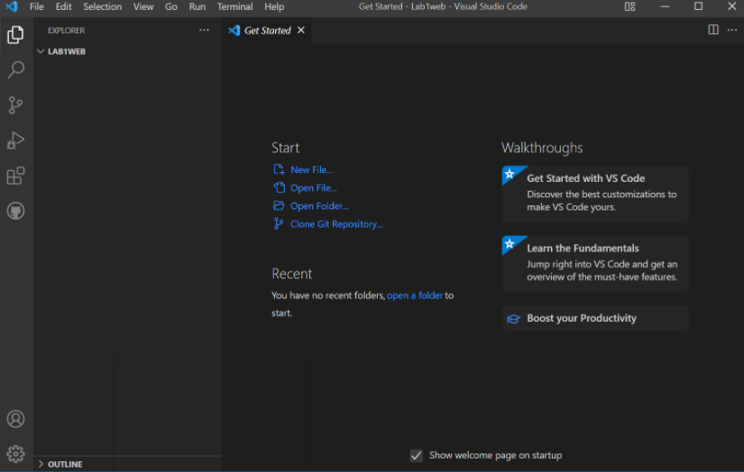
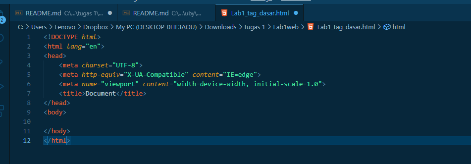
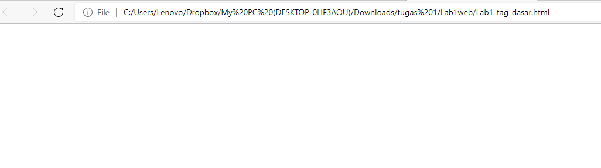

# Lab1web

| Nama      | Rafi Ubaidillah  |
| ----------- | ----------- |
| NIM     | 312010090      |
| Kelas   | TI.20.A.1        |

## **Langkah-Langkah Praktikum**

Persiapan membuka VSCode dan Browser

Kemudian buat file baru dengan nama Lab1_tag_dasar.html dan tambahkan dasar dokumen HTML. 

# Modul Praktikum Pemrograman Web

kemudian selanjutnya,buka file tersebut pada web browser misalnya **google chrome.** 
